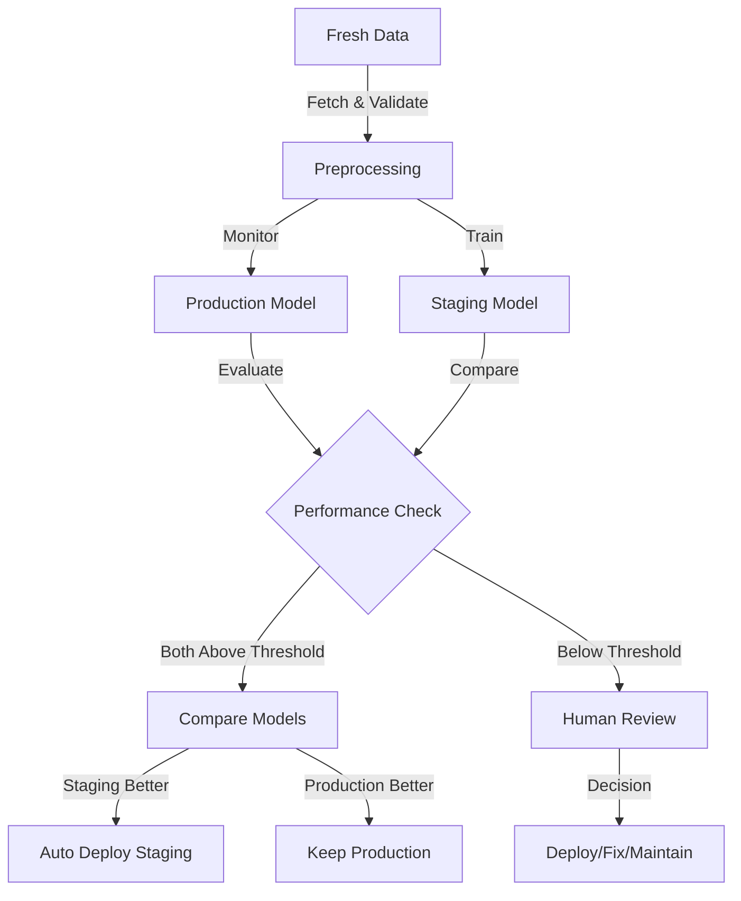

# 🚀 Cloud ML Training Pipeline

A production-ready machine learning training pipeline that implements automated model monitoring, evaluation, and smart deployment using Google Cloud Platform (GCP).

## 🎯 Overview

This project implements an automated MLOps workflow that:



### 1. Continuous Monitoring 🔍
- Monitors Production model performance over time
- Tracks data quality and model metrics
- Alerts on performance degradation

### 2. Automated Data Pipeline 🔄
- Fetches fresh taxi trip data automatically
- Preprocesses new data using standardized pipeline
- Maintains data quality through validation checks

### 3. Parallel Model Evaluation 📊
- Evaluates Production model on fresh data
- Trains new Staging model simultaneously
- Compares Performance:
  ```
  Production Model ⚡️  vs  Staging Model 🆕
  ```

### 4. Smart Deployment Decisions 🤖
The system automatically decides deployment based on:
- **Performance Threshold**: Models must achieve minimum R² score
- **Comparison Rules**:
  ```python
  if staging_performance > production_performance and staging_performance > threshold:
      deploy_staging_to_production()
  elif production_performance > threshold:
      maintain_current_production()
  else:
      notify_human_for_review()
  ```

### 5. Human-in-the-Loop Safety 🛟
When models don't meet criteria:
- Notifies ML team for review
- Provides performance comparison data
- Allows manual deployment decisions
- Tracks required fixes and improvements

### 6. Production Deployment 🚀
- Automated deployment of approved models
- Version control of model artifacts
- Rollback capabilities if needed
- Continuous performance monitoring


